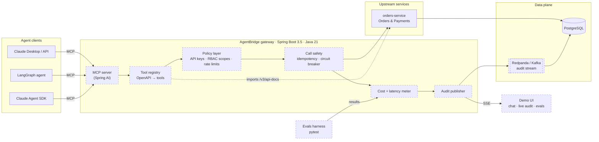

# AgentBridge

**A governed MCP gateway for existing Spring services.** Point it at an OpenAPI spec and get auth-scoped, rate-limited, audited, cost-tracked tools that Claude, Bedrock or a local model can call — without rewriting the service underneath.

> **Status: M0 — skeleton.** The stack builds, boots and talks to itself end to end. Tool generation, governance and the agent side land in M1–M4; the roadmap below says exactly what is and is not wired, and `GET /api/v1/info` reports the same thing at runtime.

---

## The problem

Most enterprises that want agents already have the business logic: a decade of Spring services with real auth, real invariants and real money moving through them. The gap is not intelligence, it is **governance**. Handing an agent a service account and an HTTP client gives you no answer to:

- which tools may this caller use, and with what scopes?
- what happens when the agent retries a payment?
- what did the agent actually call last Tuesday, and what did it cost?
- how do you know a prompt change did not make tool selection worse?

AgentBridge sits between the two and answers those four questions.

## Architecture



Dashed = not implemented yet (M1+). Solid today: the gateway, the orders upstream, Postgres, and the wiring between them.

## Quickstart

Requires Docker (or Colima) and nothing else — the JDK and Maven live inside the build image.

```bash
git clone https://github.com/<user>/agentbridge.git
cd agentbridge
cp .env.example .env          # optional; only needed from M1 for LLM calls
docker compose up --build -d  # postgres + redpanda + orders-service + gateway
./scripts/smoke.sh            # catalogue → order → idempotent replay → payment
```

First build pulls the Maven and Temurin images and takes a few minutes; after that it is cached.

| URL | What |
|---|---|
| http://localhost:8080/api/v1/info | Gateway version and honest capability flags |
| http://localhost:8080/api/v1/upstreams | Declared upstreams and their reachability |
| http://localhost:8080/actuator/health | Gateway health, including upstream checks |
| http://localhost:8081/swagger-ui.html | The upstream API that M1 turns into MCP tools |
| http://localhost:8081/v3/api-docs | The OpenAPI spec itself |
| http://localhost:8081/api/catalog/items | Read-only catalogue (a safe guest tool later) |

Tear down with `docker compose down`, or `docker compose down -v` to drop the database volume too.

## The upstream is not a toy

`orders-service` is a deliberately realistic target, because the interesting governance problems only show up against one:

- **Idempotency that actually holds.** `POST /api/orders` and `POST /api/orders/{id}/payments` store an `Idempotency-Key` with a fingerprint of the request. A replay returns the original resource; the same key with a different body is rejected with `409 idempotency_key_reuse`. An agent that retries on timeout cannot double-charge a customer.
- **Money invariants.** A capture must equal the order total; a paid or cancelled order cannot be paid again.
- **A real schema.** Flyway migrations, `timestamptz`, check constraints, foreign keys, indexes on the query paths.
- **A documented contract.** springdoc publishes the OpenAPI spec that the gateway imports in M1, with each mutating operation labelled as such.

## Local development

```bash
make build    # mvn verify — compiles both modules and runs the tests
make test     # tests only
make up       # docker compose up --build -d
make logs     # tail everything
make smoke    # end-to-end check against a running stack
make down     # stop (ARGS=-v also drops the volume)
```

Running the JVM directly needs Java 21 and Maven:

```bash
export JAVA_HOME=$(/usr/libexec/java_home -v 21)
mvn -pl orders-service spring-boot:run   # needs Postgres on :5432
mvn -pl gateway spring-boot:run
```

Tests use H2 in PostgreSQL mode and need no containers. Testcontainers-based integration tests arrive in M5.

## Repo layout

```
gateway/         Spring Boot gateway — MCP server, policy, audit, cost (M0: registry + health)
orders-service/  Sample upstream — Orders & Payments with idempotent, documented endpoints
scripts/         smoke.sh and friends
docs/            Architecture notes and milestone write-ups
Dockerfile       One multi-stage recipe, MODULE build-arg selects the module
docker-compose.yml  The whole local stack
```

## Roadmap

| Milestone | Scope | Status |
|---|---|---|
| **M0** | Repo, compose stack, realistic upstream, architecture docs | ✅ done |
| **M1** | OpenAPI → MCP tools; call them from Claude via Spring AI; audit every call to Kafka + Postgres | next |
| **M2** | API keys, per-tool RBAC scopes, per-key rate limits, idempotency enforcement, circuit breakers, dead-letter for failed audits | planned |
| **M3** | Chat UI, live tool-call and audit stream over SSE, per-key/tool/provider cost tracking | planned |
| **M4** | Python agents (LangGraph + Claude Agent SDK) against the gateway, pytest evals harness, evals dashboard | planned |
| **M5** | End-to-end OTel tracing, Testcontainers integration tests, k8s manifests + HPA, published load-test numbers | planned |
| **M6** | Public demo with a read-only guest key, cost cap, and a 2-minute walkthrough | planned |

## Design notes

- **Declared, not discovered.** Upstreams are listed in configuration. An agent gateway that auto-discovers services is an agent gateway that will one day expose one you did not mean to.
- **The capability endpoint never lies.** `/api/v1/info` is generated from what is wired, so the demo cannot drift ahead of the code.
- **Kafka from day one, Postgres as the fallback.** The audit stream is a stream. If the demo host runs out of memory, the README will say so and the outbox table takes over — not silently, in writing.
- **Stack choices are the boring ones on purpose:** Spring Boot 3.5, Java 21, Flyway, Resilience4j, OpenTelemetry. This is meant to look like something you could drop into an existing estate on a Monday.

## Who built this

Rishabh Gupta — senior Java/Spring Boot + Kafka engineer (6 yrs: AT&T Prepaid, Metro by T-Mobile at 50K+ RPM, Marriott Vacation Club payments), now building LLM and agent integrations into enterprise Java stacks with Spring AI, MCP, Bedrock and Python/LangGraph.

Available for remote contracts. [rishabh.qc991@gmail.com](mailto:rishabh.qc991@gmail.com)

## License

MIT — see [LICENSE](LICENSE).
